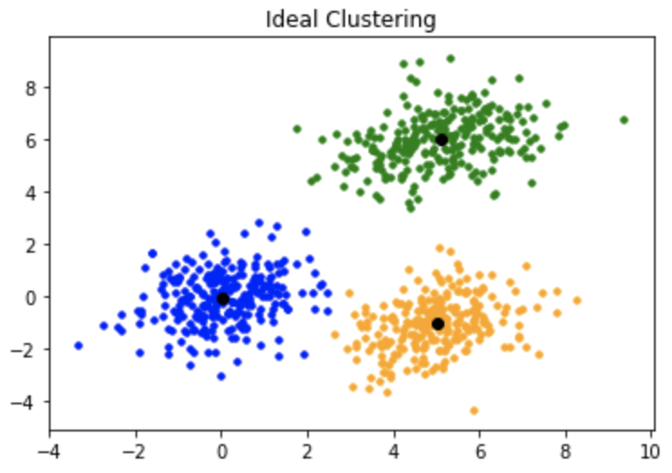
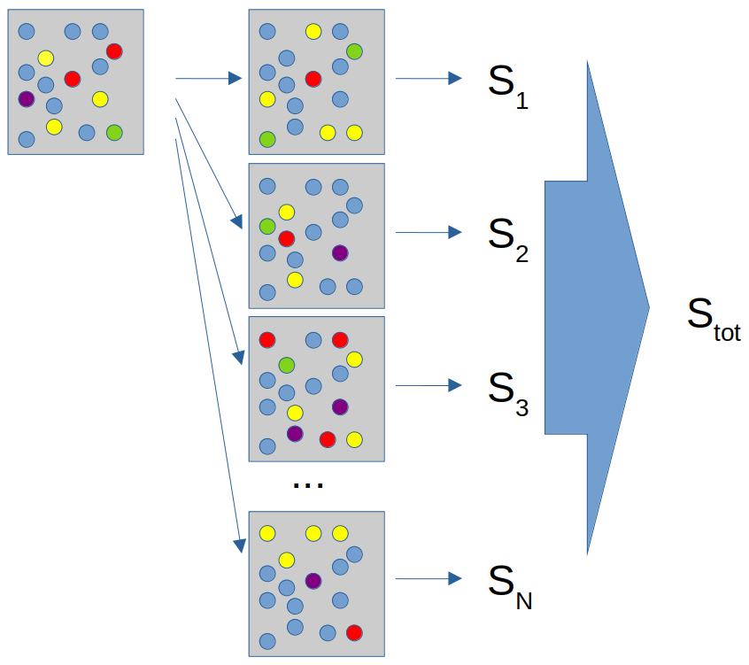

<!-- paginate: true -->

# Currently existing parallel functions in R

## Course: Parallel computing in R

---

# Example: replicate

```
x <- cbind(mtcars$wt, mtcars$hp)
y <- replicate(n = 10, expr = x, simplify = F)
```

### Parallel version

```
clone <- function(dest,source) {
  source
  }
library(parallel)
x <- cbind(mtcars$wt, mtcars$hp)
y <- vector(mode = "list", length = 10)
mclapply(y, mc.cores = [no_cores], clone, source = x)
```

---

# Parallel K-mean

---

# K-means clustering

<row>
<div class="column50">

* Unsupervised learning
* Grouping of data
* Other clustering methods exist

<div class="columnblue">

1. Start with **N** centroids
1. Group individual datapoint to nearest centroid
1. Calculate mean of all groups
1. Set new centroid as the mean
1. Repeat 2 to 4 until no change

</div>

</div>
<div class="column50">




</div></row>

---

# K-means clustering


---


### Basic function with linear execution

```
library(clusternor)
kmeans(data.frame(),centers=[centroids])
```

### Package clusternor provide parallel k-means 

```
library(clusternor)
Kmeans(data.matrix(),centers=[centroids],nthread=[threads])
```


```
library(clusternor)
iris.mat <- as.matrix(iris[,1:4])
k <- length(unique(iris[, dim(iris)[2]])) # Number of unique classes
kms <- Kmeans(iris.mat, k, nthread=1)
```

---

# Parallel bootstrap

---

# What is bootstrap

<row>
<div class="column50">

* Drawing random samples, with replacement, from original samples to create **N** simulated datasets
* Allows for the calculation of standard errors, confidence intervals, etc
* Avoids cost of repeating the experiment to get other groups of sampled data

</div>
<div class="column50">




</div></row>

---

# Bootstrap example

### Bootstrap analysis to report confidence interval of cars horsepower

```
library(boot)
Mean <- function(data, idx) {
  c <- data[idx,]
  return(mean(c))
  }
x <- data.frame(mtcars$hp)
res <- boot(x, Mean, R=1000)
plot(res)
ci <- boot.ci(res, type="basic")
sprintf("95%% CI from %f - %f", ci$basic[1,4], ci$basic[1,5])
```

---

# Permutation

<row>
<div class="column50">

* Testing *null hypothesis* under all possible rearrangements of the observed data points
* Are primarily used to provide a p-value
* Drawing random samples, without replacement, from original samples to create **R** datasets

</div>
<div class="column50">

| sim | type |
| --- | --- |
| ordinary | bootstrap |
| permutation | permutation |

```
boot.ci(x, type="basic", sim="[type]")
```

</div></row>

---

# How to use this function in parallel

### Parameter: parallel

| type | library | cl |
| --- | --- | --- |
| No (Default) | |
| multicore | parallel | |
| snow | snow, permutation | cluster |

```
boot.ci(x, type="basic", parallel="[type]", ncpus=[cores], cl=[cluster])
```

---

# There might be more already parallel functions
