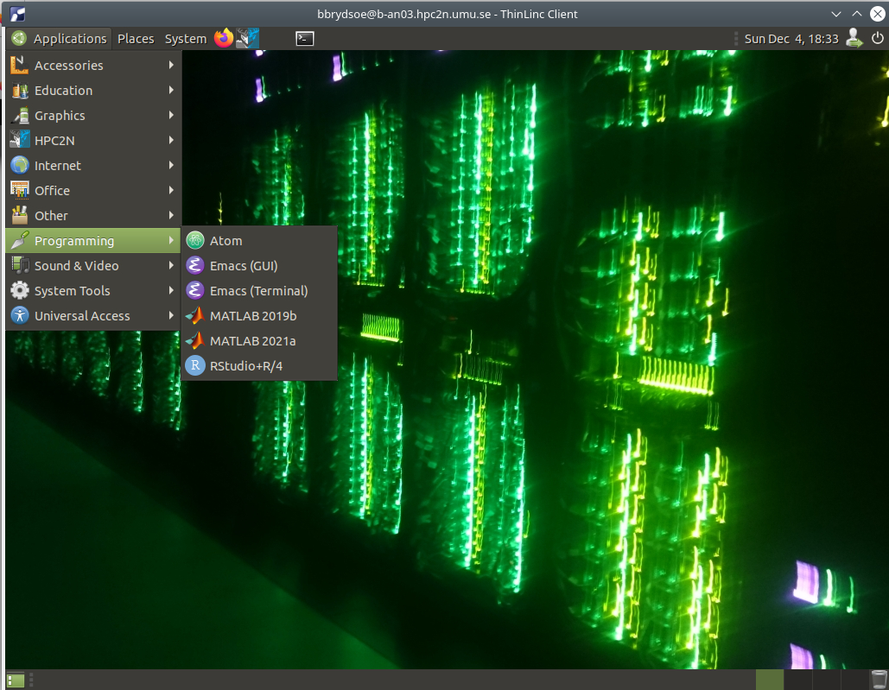

<!-- paginate: true -->

# Introduction to HPC2N

## Course: R in an HPC environment

---

# Overview

1. Connecting to Kebnekaise
1. Editors, file system
1. The module environment
1. Loading R, available packages
1. Installing your own R packages
1. Accessing RStudio
1. Running R through the batch system, examples 

---

# Connecting to Kebnekaise

1. **ThinLinc** is recommended
1. Download the client from https://www.cendio.com/thinlinc/download
1. Install the client and start it.
1. Enter the servername: *kebnekaise-tl.hpc2n.umu.se*. Enter your username under ”Username”.
1. Go to ”Options” -> ”Security” and check that authentication method is set to password.
1. Go to ”Options” -> ”Screen”. Uncheck ”Full screen mode”.
1. Enter your HPC2N password. Click ”Connect”
1. More information here: https://www.hpc2n.umu.se/documentation/guides/thinlinc

---

# Connecting to Kebnekaise - other SSH clients

1. Linux, macOS: 
  * Connect with ```ssh username@kebnekaise.hpc2n.umu.se```
  * Opening a gui? Use ```ssh -Y username@kebnekaise.hpc2n.umu.se``` 
  * For macOS you may need to install XQuartz first
2. Windows: 
  * Get SSH client (MobaXterm, PuTTY, Cygwin ...) 
  * Get X11 server if you need graphical displays (Xming, ...)
  * Start client. Login with HPC2N username to
```kebnekaise.hpc2n.umu.se``` 
---

# Editors

Editing your files on Kebnekaise (OS: Linux Ubuntu) 

* Several editors available; vi/vim, nano, emacs...
* vi/vim: 
  * Open/create file: ```vi <filename>```
  * Insert before: ```i```
  * Save and exit: Press ESC and then type ```:wq``
* nano: 
  * Open/create file: ```nano filename```
  * Save and exit: Ctrl-x (Press CTRL and x together)

---

# File system

More info: http://www.hpc2n.umu.se/filesystems/overview


---

# The module environment

Most programs are accessed by first loading them as a ’module’

Modules:
* are used to set up your environment (paths to executables, libraries, etc.) for a particular (set of) software package(s)
* help users manage their Unix/Linux shell environment, allows groups of related environment-variable settings to be made/removed dynamically
* allows access to multiple versions of a program/package by loading a module
* are installed in a hierarchial layout; some modules are only available after loading a specific compiler and/or MPI version 

**Compiler toolchains**: software-bundles for complete environments (compilers, prebuilt software). Includes: compiler suite, MPI, BLAS, LAPACK, ScaLapack, FFTW, CUDA.

---

# Loading the R module


Check existing modules (versions): ```ml spider R```

* We recommend ```R 4.0.4``` on Kebnekaise
* To check how to load this and any prerequisites:
```ml spider R/4.0.4```
* Load the module: ```ml GCC/10.2.0 OpenMPI/4.0.5 R/4.0.4```
* Loading (with CUDA support): ```ml GCC/10.2.0 CUDA/11.1.1 OpenMPI/4.0.5 R/4.0.4```
* To see other available R versions: ```ml spider R```
* To see available modules in general: ```ml spider``` and ```ml avail```

You start R by typing ```R``` on the command line.

---

# R packages needed for this course

* **parallel**
* **Rmpi**
* **foreach**
* **doParallel**
* **cluster**
* **boot**
* knor (now called clusternor)

Most of these packages (marked above in **bold**) are available as extensions to the R module on Kebnekaise and so are loaded together with the R module. You can see a list of extensions with ```ml spider R/4.0.4```. 

---

# Available R packages 

In general: to see which packages are available in your R version, start R and enter this: 

```installed.packages()```

In some cases entering these four lines will give a more thorough result: 

```console
ip <- as.data.frame(installed.packages()[,c(1,3:4)])
rownames(ip) <- NULL
ip <- ip[is.na(ip$Priority),1:2,drop=FALSE]
print(ip, row.names=FALSE)
```

---

# Installing your own R packages 

Installing from inside R (once per package):

* Find the name of the package. Load the "R" module. Start the "R" program
* Type “install.packages(“RPACKAGE”)”, where RPACKAGE should be changed to the name of the package in question. Press the Enter/Return key.
* If you have not installed other packages during this session, you will be prompted to choose a mirror to download from.
* When the prompt is again ">" the package has finished downloading and installing.

From command line (if no dependencies and R module loaded): 
* ```R --quiet --no-save --no-restore -e "install.packages('RPACKAGE', repos='http://ftp.acc.umu.se/mirror/CRAN/')"```

---

# Installing your own R packages

Manual download and install 

* Download from the package from http://cran.r-project.org/ or elsewhere (GitHub etc.)
* Load the "R" module
* Install with ```R CMD INSTALL -l $HOME/R-packages-4.0.4 RPACKAGE.tar.gz``` (change to your chosen R package directory and name of R package in question)

Regardless of how you installed the R package, you can now use it the same way as other R packages: by loading it inside R with the command ```library("RPACKAGE")``` 

---

# Installing other R packages

While clsuternor is the only one of the needed packages not installed on Kebnekaise, there will likely be several to install on your own computer. 

NOTE: if you are using Linux Ubuntu (R installed with ```sudo apt-get install r-base```), some packages can be installed from the Ubuntu repo: 

* r-cran-rmpi r-cran-foreach r-cran-doparallel r-cran-cluster r-cran-boot

Install the "parallel" package with ```install.packages(c("parallel"))``` from within R. 

Check with ```installed.packages()``` (from inside R) which are installed. 

---

# Installing R packages for the course

* Install help, all OS: https://www.hpc2n.umu.se/events/courses/2022/R-in-HPC/setup 

* Specific for Linux Ubuntu: https://umeauniversity.sharepoint.com/:w:/s/HPC2N630/EeLAM89iSrhHuMbduJkzjDwBoqxTHNo5TF6b0TplvaoLPw?e=gxgW4p

---

# Installing the R package "clusternor" on Kebnekaise 

"clusternor" package (https://github.com/neurodata/knorR)

* Setup a directory for R packages (already done if you have installed packages).
  * Add ```R_LIBS_USER="path/to/rpackages"``` to the file .Renviron (change "path/to/rpackages" to actual location)
  * Example: ```R_LIBS_USER="/proj/nobackup/support-hpc2n/bbrydsoe/R-packages-%V"```
* Since "clusternor" is no longer on CRAN, we have to install from their GitHub. 
* ```git clone --recursive https://github.com/flashxio/knorR.git```
* cd knorR
* ./install.sh

---

# Installing Rstudio - own computer 

To install Rstudio on your own computer, see the links on setup: 

* https://www.hpc2n.umu.se/events/courses/2022/R-in-HPC/setup 

* Specific for Linux Ubuntu: https://umeauniversity.sharepoint.com/:w:/s/HPC2N630/EeLAM89iSrhHuMbduJkzjDwBoqxTHNo5TF6b0TplvaoLPw?e=gxgW4p

---

# Accessing Rstudio on Kebnekaise 

To use Rstudio on Kebnekaise, you need to connect using ThinLinc as it is not installed on the regular login nodes. It matches R 4.0.4. 



---

# Running longer/paralle R programs 

* Large/long/parallel jobs **must** be run through the batch system 

* SLURM is an Open Source job scheduler. It provides three key functions
  * Keeps track of available system resources
  * Enforces local system resource usage and job scheduling policies
  * Manages a job queue, distributing work across resources according to policies
* To run a batch job, you need a SLURM submit file (batch submit file, batch script, job script ...) 
* When submitting jobs to the batch system, you **must** use the course project! 
* Guides and documentation at: http://www.hpc2n.umu.se/support

---

# Useful commands to the Batch System

* Submit job: ```sbatch <jobscript.sh>``` (successful submission returns a job-id number) 
* As default, output/errors are found in ```slurm-<job-id>.out``` 
* Get list of all jobs: ```squeue```
* Get list of only your jobs: ```squeue -u <username>```
* Adding the flag ```--start``` gives the estimated job start time. This can change depending on other people's jobs. 
* Check on a specific job: ```scontrol show job <job id>```
* Delete a specific job: ```scancel <job id>```
* Delete all your jobs: ```scancel -u <username>```

---

# SLURM batch script for a serial R job 

```console
!/bin/bash
#SBATCH -A SNIC2022-22-1012 #Project id
#SBATCH -J my-serial-R-job #Name of job
#SBATCH --time=00:10:00 #Jobtime (HH:MM:SS) Max: 168H
#SBATCH -o Rjob_%j.out #Naming the output file
#SBATCH -e Rjob_%j.err #Naming the error file
#SBATCH -n 1 #Number of tasks (Default is 1 CPU/task. Change with --cpus-per-task) 

ml purge > /dev/null 2>&1
ml GCC/10.2.0 OpenMPI/4.0.5 R/4.0.4

R --no-save --quiet < input.R > Rexample.out
```

---

# SLURM batch script for a parallel R job, using Rmpi

NOTE that you need to load the Rmpi library within your R script for this to work

```console
!/bin/bash
#SBATCH -A SNIC2022-22-1012
#SBATCH -n 8
#SBATCH --time=00:30:00

ml purge > /dev/null 2>&1
ml GCC/10.2.0 OpenMPI/4.0.5 R/4.0.4

mpirun R -q -f <program>.R
```

---

# SLURM batch script for a parallel R job, using doParallel

Assume we have a small R program, "doParallel.R": 

```R
library(doParallel)
cl <- makeCluster(4)
registerDoParallel(cl)

# code that we want executed in parallel

stopCluster(cl)
```

---

# SLURM batch script for a parallel R job, using doParallel - continued

 Batch script to submit the R program on the previous slide: 

```console
!/bin/bash
#SBATCH -A SNIC2022-22-1012
#SBATCH -t 00:10:00
#SBATCH -N 1
#SBATCH -c 4

ml purge > /dev/null 2>&1
ml GCC/10.2.0 OpenMPI/4.0.5 R/4.0.4

R -q --slave -f doParallel.R
```

---

# Various useful info

* A project has been set up for the workshop: ```SNIC2022-22-1012```
* You use it in your batch submit file by adding: 
  * ```#SBATCH -A SNIC2022-22-1012```
* Kebnekaise ThinLinc login node: ```kebnekaise-tl.hpc2n.umu.se```
* Kebnekaise "regular" login node: ```kebnekaise.hpc2n.umu.se```
