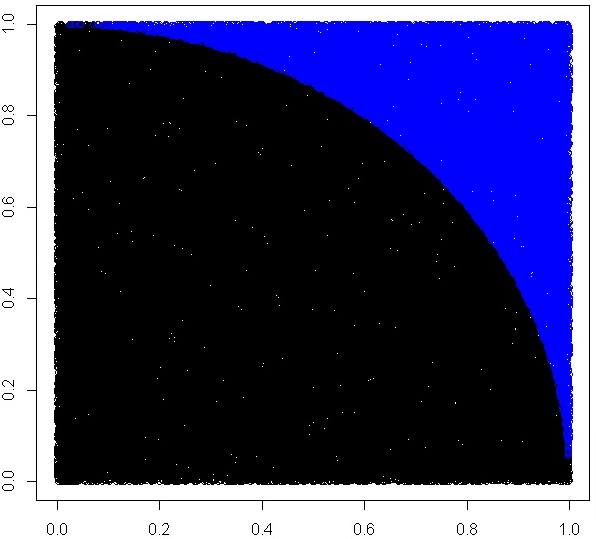

# Example: Calculate PI using montecarlo

<row>
<div class="column50">

1. Randomize a number of x and y values (0-1)
2. Calculate distance from origo
3. Count values with distance>1
4. Multiply by 4 since we have a quarter circle 

```
calcpi <- function(no) {
  y <- runif(no)
  x <- runif(no)
  z <- sqrt(x^2+y^2)
  length(which(z<=1))*4/length(z)
  }
```

</div>
<div class="column50">



</div></row>

---

# Lab: Calculate PI using parallel lapply

<row>
<div class="column50">

1. Implement the function calcpi using **lapply**
1. Time your code
 