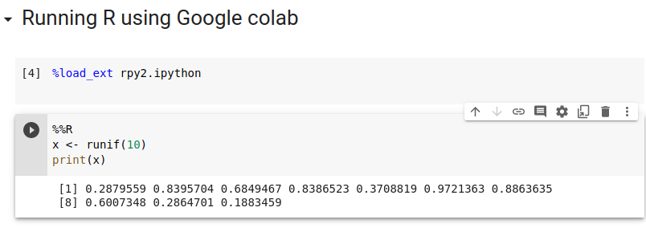
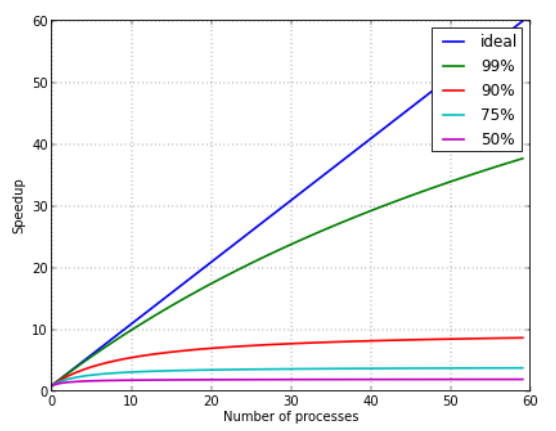

<!-- paginate: true -->

# Introduction to parallel R

## Course: Parallel computing in R

---

# Overview

1. Client software
1. Installing packages
1. How to run R in parallel
1. Functions in R for speeding up execution

---

# Client software

---

# How to install R/RStudio on Linux

https://posit.co/download/rstudio-desktop/


---

# Running R using Jupyter-notebook

1. Create a new google colab notebook
   https://colab.research.google.com/#create=true
1. You can run both R and Python
1. You can install R packages (within limits)



---

# Installing R packages

---

# How to install packages in R

<row>
<div class="column50">

### List of packages
#
#
#
### Where are they installed
#
### Install packages

</div>
<div class="column50">

```
> installed.packages()
         Package
Matrix   "Matrix"
Rmpi     "Rmpi"
base     "base"
```

```
> .libPaths()
[1] "/home/hzazzi/R/3.6"
[2] "/usr/local/lib/R/site-library"  
```
```
> install.packages("<NAME>",
    lib=.libPaths()[1])
```

</div></row>


---

# How to install R packages on cluster

1. Create folder for your R library
   ```
   mkdir ~/myR/library
   export R_LIBS_USER=~/myR/library
   ```
1. Install the package you need in your local folder
   ```
   > .libPaths()
   [1] "/home/hzazzi/myR/library"
   [2] "/usr/local/lib/R/site-library"  
   > install.packages("<NAME>",lib=.libPaths()[1])
   ```

---

# How to run R on cluster

---

# How to run interactively

1. Request a SLURM job allocation
   ```
   salloc -A <ALLOCATION> -p shared -N 1 -t 10
   ```
1. Add the necessary modules
   ```
   ml R/<VERSION>
   ```

---
# How to run interactively (2)

<row>
<div class="column50">

1. Run!
   ```
   srun -n 1 R --no-save < [myscript]
   ```
   ```
   srun -n 1 Rscript [myscript]
   ```
1. Exit the job allocation
   ```
   exit
   ```

</div>

###

<div class="column50 columnblue">

Prints all output (code, results)

</div>
<div class="column50 columnblue">

Prints only results

</div></row>

---

# How to send in jobs

<row>
<div class="column50">

1. Create an SBATCH script file
1. Send in the job
   ``` 
   sbatch [myscript]
   ``` 
1. Monitor the job
   ``` 
   squeue -u [username]
   ``` 
1. Kill the job (if needed)
   ``` 
   scancel [jobID]
   ``` 

</div>
<div class="column50">

```
#!/bin/bash -l
# Set the job allocation
#SBATCH -A <allocation>
# Run on a shared partition
#SBATCH -p shared
# The name of the script is myjob
#SBATCH -J myjob
# Only 1 minute wall-clock time
#SBATCH -t 1:00
# Number of nodes
#SBATCH --nodes=1
#SBATCH -e error_file.e
#SBATCH -o output_file.o
# Load the modules
module add R/<VERSION>
srun -n 1 R --no-save < [R file]
```

</div></row>

---

# Functions in R for speeding up execution

---

# Time your software

* Calculate how fast your code is
* Compare parallel execution of your code with increasing number of processes

<row>
<div class="column50">

1. Method 1
   ``` 
   start_time <- Sys.time()
   <ALL THE CODE>
   print(Sys.time() - start_time)
   Time difference of 16.87934 secs
   ``` 
1. Method 2
   ``` 
   library(microbenchmark)
   print(microbenchmark({
     <ALL THE CODE>
     }))
   expr min lq mean median uq max neval
   ```
   ```
   summary(microbenchmark(<CODE>))$mean
   ``` 

</div>
<div class="column50">



</div></row>

---

# apply function collection

1. Executes functions **FUN** to elements of variable **X**
1. Compiled optimization as we do not have to do a *for* loop
1. Works on internal and user defined functions

---

# Example of lapply

* We have a list of vectors (Default dataset of co2 concentrations in ppm 1959 to 1997)
  ``` 
  x <- split(co2, ceiling(seq_along(co2)/12))
  ``` 
* Using **for** loop to calculate yearly mean of *x*
  ``` 
  for (i in x) {
   print(mean(i))
   }
  ``` 
* Using **lapply** to calculate mean of *x*
  ``` 
  print(lapply(x, mean))
  ``` 

---

# Table of functions

| Function | Arguments | Objective | Input | Output |
| --- | --- | --- | --- | --- |
| apply | apply (x, M, FUN) | Apply to rows (M=1), columns (M=2), both (M=c(1,2()) | Data frame, vector | Vector, list, array |
| lapply | lapply(x, FUN) | Apply to all elements of the input | List, vector, data frame | list |
| sapply | sapply(x, FUN) | apply to all the elements | List, vector, data frame | Vector, matrix |

---

# Example: replicate

### Easy method to multiply your data for additional analysis

``` 
y <- replicate(n = 10, expr = co2, simplify = F)
``` 

### Replicate is a wrapper for sapply

| Simplify | Type |
| --- | --- |
| TRUE | Array |
| FALSE | List |
