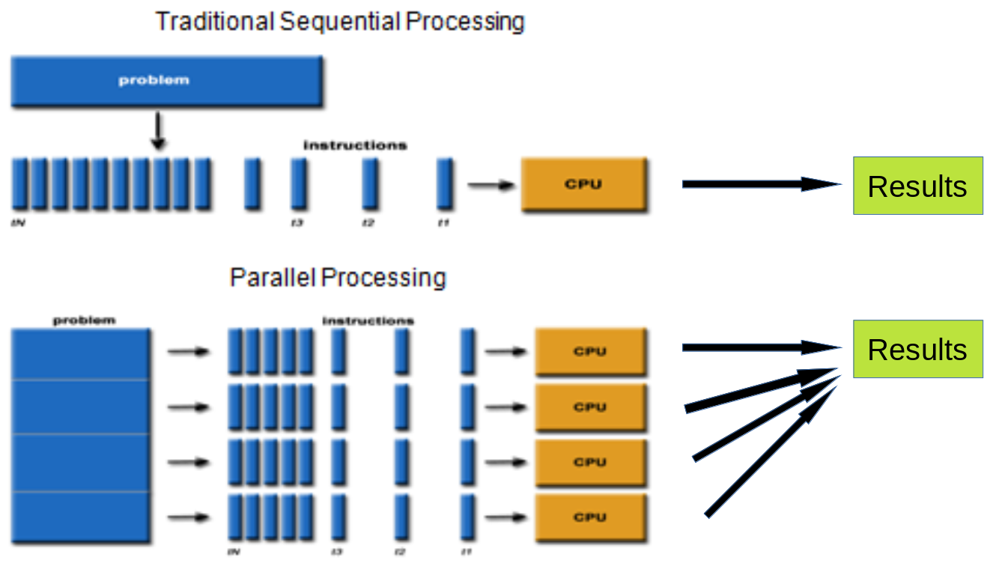
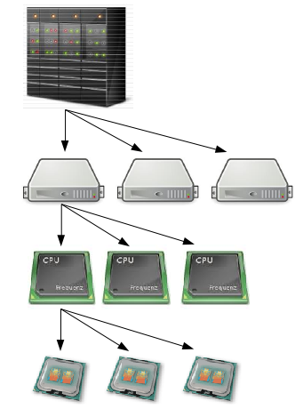
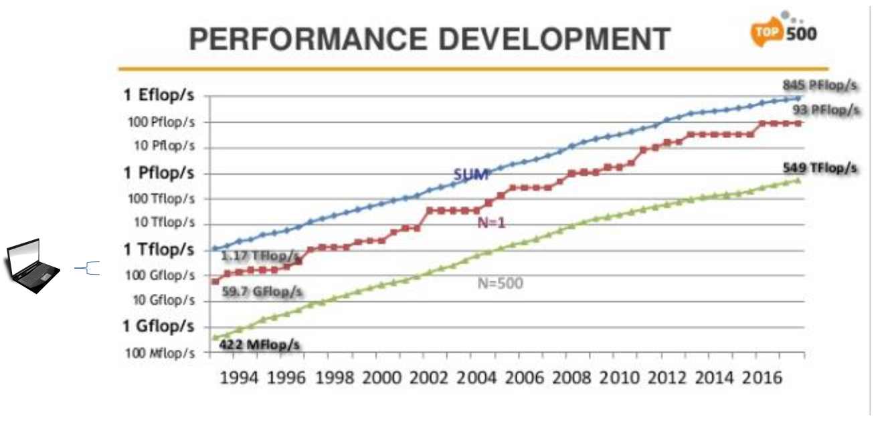
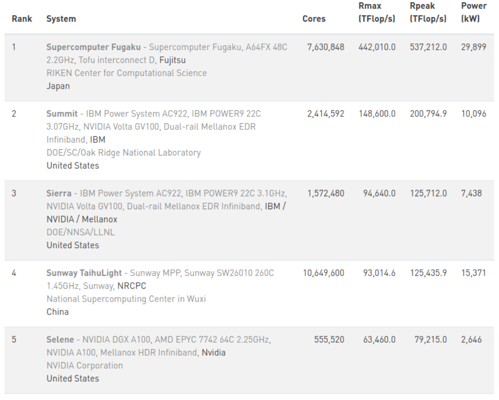
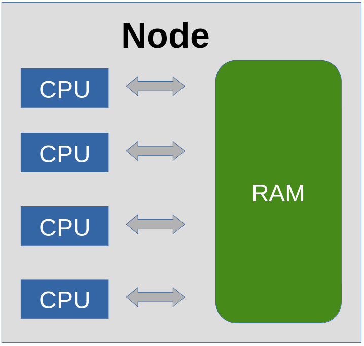
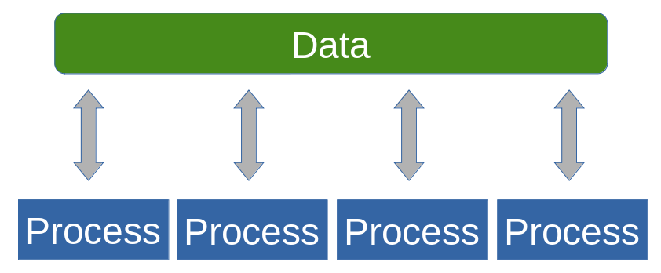
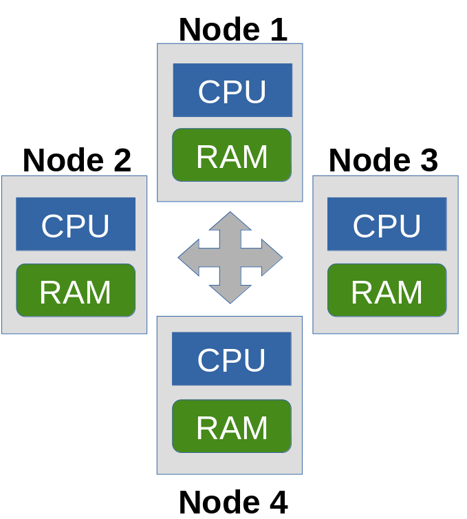
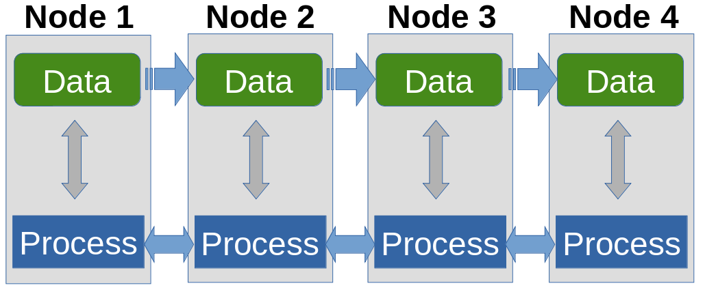
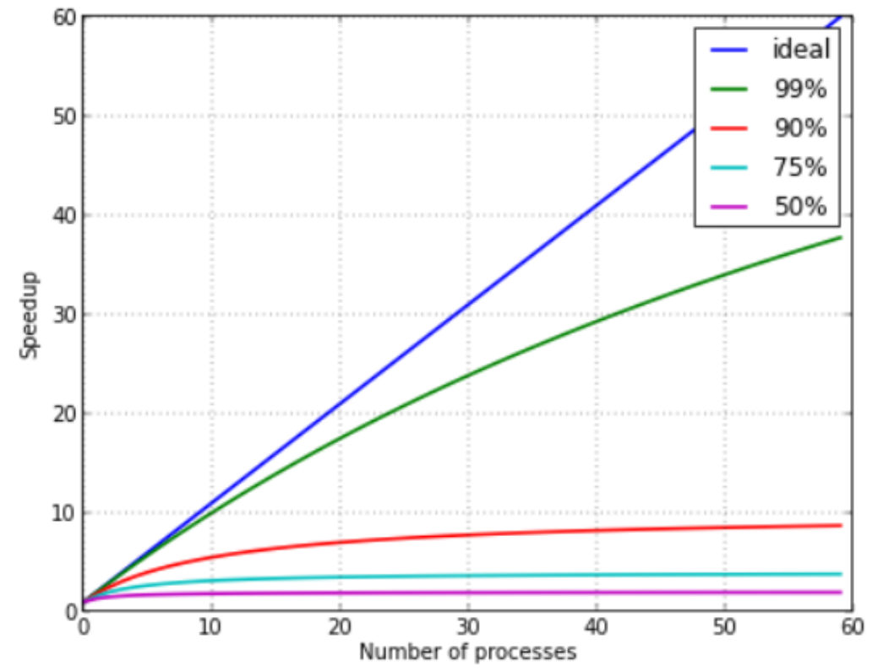
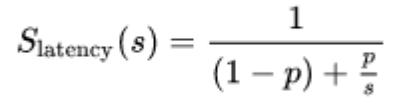

<!-- paginate: true -->

# What is parallelization

## Course: Parallel computing in R

---

# Overview

1. Introduction to supercomputers
1. Shared memory computing
1. Distributed memory computing
1. Scaling

---

# Introduction to supercomputers

---

# Supercomputers can be useful when...

1. Your problem is too large to be solved in a single computer
1. The solution to your problem is requiring too much time to be solved

---

# Parallel methodology

---

# What is a cluster

# Cluster
#
# Nodes
#
# CPUs
# Cores

---

# HPC cluster

* HPC cluster is a collection of normal computers connected together

Performance is measured in *floating point operations
per second*, **flop/s, FLOPS**

* Fast interconnect to make possible inter-node communications
* Software to manage communications between the nodes
* Workload manager

---

# HPC development

---

# Top 500 list

November, 2020
https://www.top500.org/lists/top500/2020/11/

---

# Dardel

**Nodes:** 794
**Cores:** 101632
**Peak performance:** 13.5 PFLOPS

### Node configuration

* 2xAMD EPYC™ 2.25 GHz CPU with 64 cores each
* RAM
  * 524 nodes, 256 GB
  * 256 nodes, 512 GB RAM
  * 8 nodes, 1024 GB RAM
  * 6 nodes, 2048 GB RAM
* 4xAMD Instinct™ MI250X GPUs

---

Swedish project managed via **SNIC**

---

# Shared memory computing

---

# Shared memory hardware

### Can be executed on a standard computer

---

# Pros and cons of shared memory

### Data is available in same hardware location

1. No need to move data
1. All processing units share the same memory address space
1. It can be difficult to manage concurrent access to the memory (race conditions)

---

# Distributed memory computing

---

# Distributed memory computing

### Can be executed on a supercomputer

---

# Distributed memory computing

1. Analysis can be expanded across several nodes
1. Each CPU has access to only its own memory
1. In order to access data in another memory it needs to be transferred
1. Communications needs to be explicitly managed by the programmer

---

# Hybrid parallelism

1. Best of both worlds
1. Communications between nodes (distributed memory)
1. Computation within each node (Shared memory)

---

# Scaling

---

# The computational dilemma

### Easibility, Flexibility
#
#
#
#
#
#
#
#
#
#
### Performance

### High level programming
Python, matlab, **R**, JavaScript

### Modular programming
Python+C/C++

### Low level programming
C/C++, Fortran, Assembler

---

# Scaling

---

# Ahmdal's law

* Slatency is the theoretical speedup of the task
* *s* is the number of threads
* *p* is the proportion of executation time that benefits from improved resources

### Example
Executing a code takes 10 h, where 8 h can be parallelised. How much speedup do we get using 15 parallel processes?
p=8/10=0.8, s=15
S=1/((1-0.8)+0.8/15)=**3.9**

---

